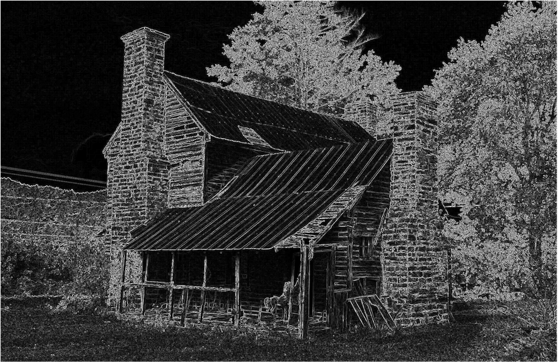

# go-effects
Parallelized image manipulation effects, written in Go.

## Overview
This library provides basic image effects, running on multiple goroutines to parallelize the processing. You can include the library directly in your code via gihutb.com/markdaws/go-effect/pkg/effects or there is a command line app that you can use to process photos in cmd/goeffects, to run:

```bash
go install ./cmd/goeffects 
goeffect --help
```

## Usage
Take a look at pkg/effects/effects_test.go for examples of how to use this library

##Package
github.com/markdaws/go-effects/pkg/effects

##Docs
See [godoc](https://godoc.org/github.com/markdaws/go-effects/pkg/effects)

##Effects
###Oil Painting
This effect takes an input image and renders it styled as an oil painting. The boldness of the stroke and the range of the palette can be modified.

####Original Image

####Modified Image (filterSize:5, levels:30)


###Grayscale
Given an input image returns a grayscale version. Three algorithms are available, lightness (average of the max and min rgb value of a pixel), average (the average of the r,g,b values), luminosity (a weighted average of the rgb values based on how humans perceive color).

The luminence algorithm generally gives the best results.
####Original Image

####Modified Image (luminosity)


###Sobel
Given an input image returns an image containing edge gradients values, based on the Sobel operator.  By default the pixel r,g,b values all contain the gradient intensity, but if you supply a threshold value to the function, then if the gradient intensity is >= threshold the pixel value will be 255 and if it is less than it will be 0.  This way you can set some threshold and use this for edge detection.

####Original Image

####Modified Image (Sobel)

